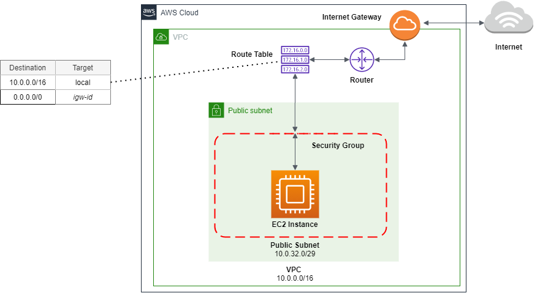

### Diagram

### Steps
1. Create a provider for AWS
2. Create an AWS key pair or use an existing one for SSH access
3. Create a VPC
4. Create a public subnet with auto public IP assignment enabled
    - it will have a Route Table that directs traffic to an Internet Gateway allowing access to and from the Internet
    - note: if a private subnet is required that can access the Internet but outside world will not be able to connect to the instance inside the subnet, use a NAT Gateway 
5. Create an Internet Gateway for instances in the public subnet to access the internet
6. Create a routing table consisting of the information of Internet Gateway
7. Associate the routing table to the public subnet to provide the Internet Gateway address
8. Create a Security Group for the EC2 instance, so that it is possible to access it by SSH
9. Create an EC2 instance
10. Create an Elastic IP

### VPC

In general, AWS creates a default VPC for each AWS region when the account is created.

#### DNS with VPC

Instance in a VPC are provided with public and private DNS hostmnames that correspond to the public IPv4 and private IPv4 addresses for the instance.

- __Private DNS hostnames__: 
    - resolves to the private IPv4 address of the instance
    - can be used for communication between instances in the same network, but not outside the network that the instance is in
    - form: `ip-private-ipv4-address.ec2.internal` for the `us-east-1` region and  `ip-private-ipv4-address.region.compute.internal` for other regions
- __Public DNS hostnames__: 
    - resolves to the public IPv4 address of the instance outside the network of the instance
    - ... and to the private IPv4 address of the instance from within the network of the instance
    - form: `ec2-public-ipv4-address.compute-1.amazonaws.com` for `us-east-1` region and `ec2-public-ipv4-address.region.compute.amazonaws.com` for other regions

DNS supported is determined by the following two attributes:
- `enableDnsHostnames`
- `enableDnsSupport`

Both are apparently enabled by default.

Corresponding (optional) arguments in terraform:
- `enable_dns_hostnames`
- `enable_dns_support`

When both are set to `true`, instances with a public IP address receive corresponding public DNS hostnames and Route 53 Resolver server can resolver AWS provided private DNS hostnames.

More: [DNS support in your VPC](https://docs.aws.amazon.com/vpc/latest/userguide/vpc-dns.html)

### Security Group

Security groups manage traffic at the server level (the resource level).
Security Groups are not for managing higher level groups such as subnets, VPC, or user accounts.  

For SSH connection, set the ports at `22` and `TCP` as protocol.  
For HTTP connection, set the ports at `80` and `TCP` as protocol.  
For HTTPS connection, set the ports at `443` and `TCP` as protocol.

To allow all sorts of traffic, set `protocol="-1"` (i.e. `All`), `from_port` and `to_port` to `0`.

### Terraform `tfvars` File

This file is used to provide values to variables.  
Alternatively, either use default values or provide the values during infrastructure provision

Terraform also automatically loads variable definitions files if:
- the files are named exactly `terraform.tfvars` or `terraform.tfvars.json`
- the file name ends in `.auto.tfvars` or `.auto.tfvars.json`

If the file name is say, variables.tfvars, specify that file in command line `terraform apply -var-file="variables.tfvars"`

### Terraform Commands

- `terraform init`: initiate terraform, install provider  
- `terraform fmt --recursive`: format code, `--recursive` for also any files inside sub-folders
- `terraform validate`: validate code  
- `terraform plan`: plan before provisining infrastructure  
- `terraform apply`: provision infrastructure  
- `terraform destroy`: nuke infrastructure  
- `terraform output`: list all outputs  

use `--auto-approve` option with `apply` and `destroy` to skip confirmation message