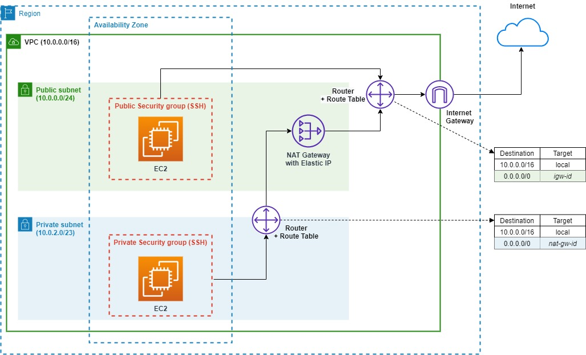

## Diagram

AWS VPC with Private and Public Subnets via Terraform

### Steps

**Create a VPC**
- Assign IPv4 CIDR block `10.0.0.0/16`. This includes all IP addresses that start with `10.0.x.x`, i.e. 65,536 IP addresses.
- Set `enable_dns_hostnames`. This will assign friendly DNS name to _EC2 instances_ in the VPC, e.g. `ec2-33-56-423-786.eu-central-1.compute.amazonaws.com`.
- To add custom DNS name, we can use AWS Route 53.

**Create a public subnet**
- Since a subnet is a sub-range of IP addresses within a network, specify an IPv4 CIDR block (`10.0.0.0/24`) which is be a subset of from the IP range of the VPC. 
- We use the Terraform expression `cidrsubnet(10.0.0.0/16, 8, 0)` to set the CIDR block. The subnet `10.0.0.0/24` includes `10.0.0.x`, i.e. 256 IP addresses.
- The subnet resides in an Availabitiy Zone (AZ). Once AZ can host multiple subnets

**Create a private subnet**
- We use the same AZ as the one used for the public subnet
- The CIDR block is `10.0.2.0/23` and the corrseponding Terraform expression using `cidrsubnet` is `cidrsubnet(10.0.0.0/16, 7, 1)` which covers the IP addresses of `10.0.2.x`and `10.0.3.x`. Check IP range for the given CIDR: `https://jodies.de/ipcalc?host=10.0.2.0&mask1=23&mask2=`

The two subnets are isolated and require internet gateway (IG) to connect to the internet.

**Create an Internet Gateway**
- Create an Internet Gateway for instances in the public subnet to access the internet

**Create a route table**
- Create a route table to allow communication with internet.
- The route table directs traffic to internet gateway
- Each subnet should be associated with a (only one) route table. You can associate multiple subnets with one route table.
- The first route in the table allows traffic within the `10.0.0.0/16` network, but does not allow outbound traffic (outside of the network)
- Associate the routing table to the public subnet to provide the Internet Gateway address, thus direct traffic to the IG allowing access to and from the Internet

**Create a security group**
- Security groups enable to specify inbound and outbound traffic to and from the EC2 instance.
- Create a Security Group for the EC2 instance, so that it is possible to access it by SSH.

**Create an EC2 instance in public subnet**
- Assign the EC2 to the public subnet and assign the security group
- Start a Apache web server via User Data option. The server serves a sample webpage that shows the current local date and time. Since the security group allows HTTP requests, the webpage should be accessible via browser.
- We keep the default storage and do not add a key pair

    6.4. Create an EC2 instance  
7. Private subnet  
    7.1. Create another subnet inside the VPC   
    7.2. Create an Elastic IP for NAT Gateway  
    7.3. Create a NAT Gateway in the public subnet  
    7.4. Create a route table for the NAT Gateway  
    7.5. Associate the above routing table to the private subnet

For the private subnet, use the CIDR `10.0.2.0/23`. The idea is to make the private subnet twice as large as public subnet since most resources should be private unless specifically required to be otherwise/public.

#### Additionally required
1. Create a provider and version for Terraform AWS
2. Create/Get an AWS key pair or use an existing one for SSH access
#### Private Subnet
- instances launched inside the private subnet will be able to communicate with any services within the VPC 
- the NAT Gateway [NAT] allows instances in the private subnet to connect to the Internet (via Internet Gateway [IGW])
    - Private subnet &rarr; NAT &rarr; IGW
- the NAT Gateway
    - is managed by AWS
    - is created/specific to AZ
    - requires an Elastic IP
    - requires an Internet Gateway for connecting to internet
    

## References:
- [Terraform recipe - Managing AWS VPC - Creating Private Subnets](https://hands-on.cloud/terraform-recipe-managing-aws-vpc-creating-private-subnets/)
- [Launching a VPC with Public & Private subnet & NAT Gateway in AWS using Terraform!](https://harshitdawar.medium.com/launching-a-vpc-with-public-private-subnet-nat-gateway-in-aws-using-terraform-99950c671ce9)
- [Terraform: AWS VPC with Private and Public Subnets](https://nickcharlton.net/posts/terraform-aws-vpc.html)
- [How to setup a basic VPC with EC2 and RDS using Terraform](https://dev.to/rolfstreefkerk/how-to-setup-a-basic-vpc-with-ec2-and-rds-using-terraform-3jij#rds)
- [CloudCasts: Security Groups](https://cloudcasts.io/course/terraform/security-groups)